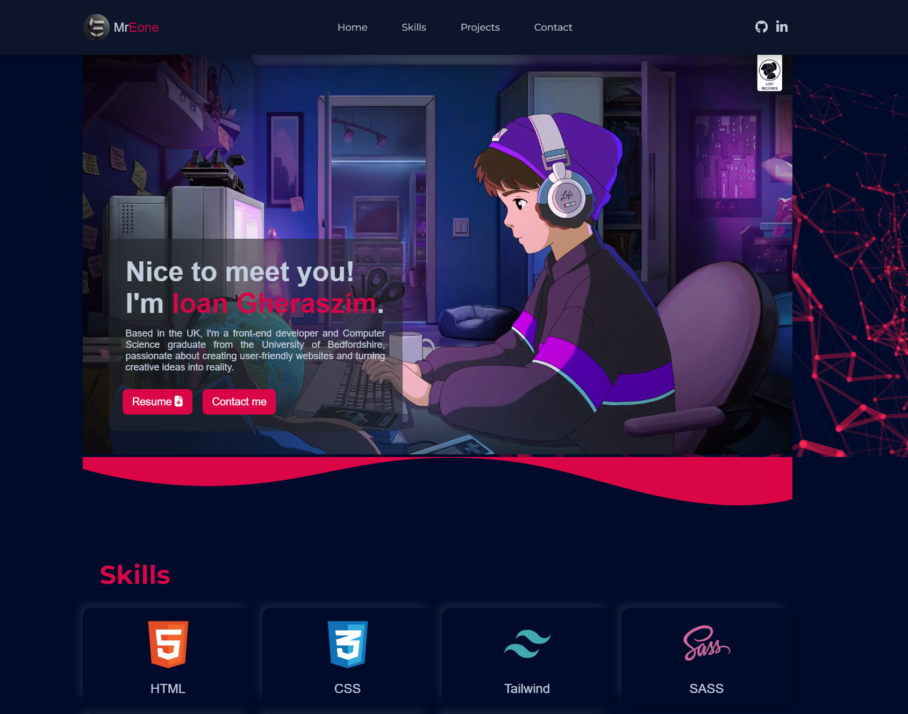
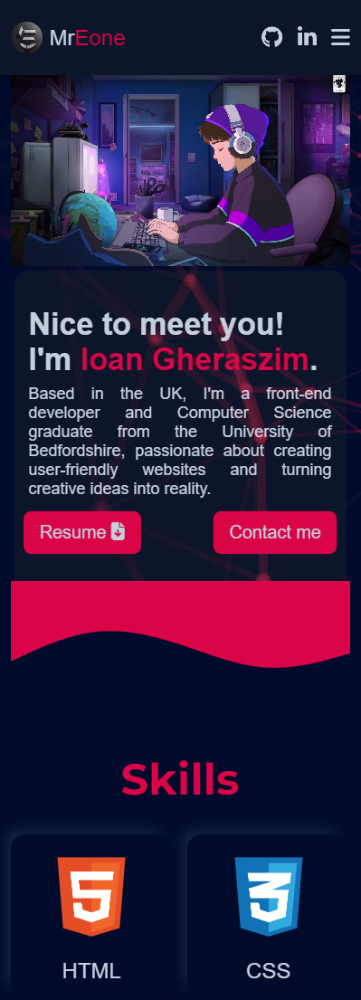
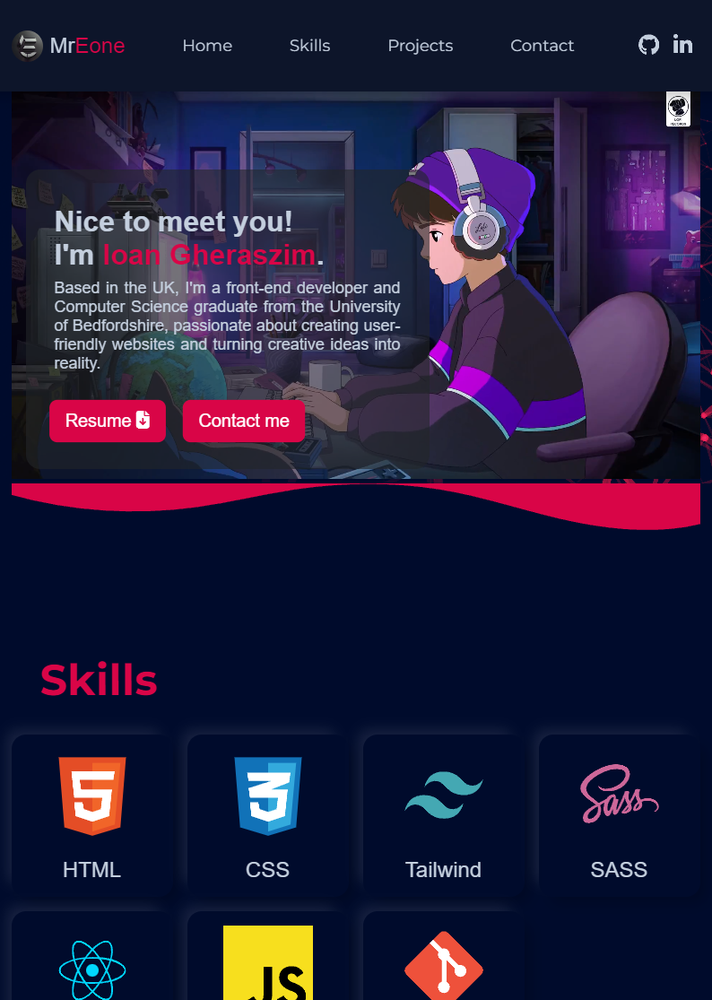

# Ioan Gheraszim Portfolio

Welcome to my portfolio! This repository showcases my skills, projects, and experience as a developer.

## Table of contents

- [Overview](#overview)
  - [Links](#links)
  - [Projects](#projects)
  - [Screenshot](#screenshot)
- [My process](#my-process)
  - [Built with](#built-with)
  - [Useful resources](#useful-resources)
- [Author](#author)

### Links

- Solution URL: [Portfolio Solution](https://github.com/ioangheraszim/portofolio)
- Live Site URL: [Live Site](https://ioangheraszim.github.io/portofolio/)

### Projects

[Project 1: ToDo App](https://github.com/ioangheraszim/Todo-App)

- This is a user-friendly task management to-do list application. It facilitates adding new tasks, marking completed ones, and refining existing entries, simplifying the process and helping users stay organized and boost productivity.

[Project 2: URL Shortner](https://github.com/ioangheraszim/url-shortening)

- Shortly's URL Shortening API simplifies long URLs, creating compact and user-friendly links for effortless sharing and a streamlined user experience. Perfect for developers and website owners looking to enhance link management.

[Project 3: Blogr Landing Page](https://github.com/ioangheraszim/Blogr-LandingPage-FE)

- Blogr Landing Page: A chic gateway to the future of publishing. This sleek and dynamic page introduces the modern features and user-friendly design of the Blogr platform, enticing visitors to explore seamless and stylish content creation.

[Project 4: Nailz](https://github.com/ioangheraszim/Nailz)

- Nailz, a solo frontend project dedicated to the world of nail beauty and education. This project is a personal endeavor to create a captivating and user-friendly e-commerce website that focuses exclusively on nail products and online/offline nail art courses.

[Project 5: AniNet](https://github.com/ioangheraszim/AniNet)

- AniNet, an online platform designed to help you explore, discover, and delve into the world of anime. AniNet is a web application created with the goal of providing an immersive experience for anime enthusiasts.

### Screenshot

- Desktop Screenshot

- Mobile screenshot

- Tablet screenshot

## My process

### Built with

- Semantic HTML5 markup
- SCSS custom properties
- Flexbox
- Grid
- Mobile-first workflow
- [React](https://reactjs.org/) - JS library

### Useful resources

- [EmailJS](https://www.emailjs.com/) - Send Email Directly From Your Code. No server code needed. Focus on things that matter! This has helped me make the contact me feature fully operational.

- [React Intersection Observer](https://www.npmjs.com/package/react-intersection-observer) - React implementation of the Intersection Observer API to tell you when an element enters or leaves the viewport. This helped me achieve animations on scroll.

## Author

- GitHub - [Ioan Gheraszim](https://github.com/ioangheraszim)
- Website - [Ioan Gheraszim](https://ioangheraszim.github.io/portofolio/)

